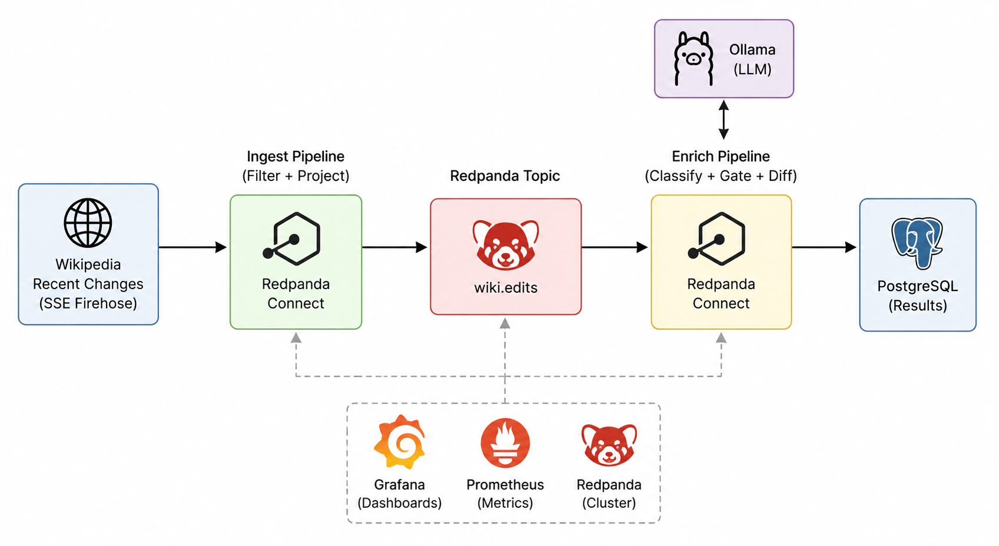

# Wikipedia Content Moderation AI Pipeline

A near-real-time moderation pipeline over Wikipedia's edit firehose. Each human edit to an article is classified — `vandalism`, `spam`, `substantive_edit`, `minor_edit`, `revert`, `other` — with a confidence score, and the flagged ones surface on a live dashboard.

**an adversarial-input classification pipeline sitting behind a topic boundary.** Ingest filters on *scope* and never touches a model; a Redpanda topic absorbs the burst; a slow enricher drains it at its own pace and judges every edit on its **actual diff**. The classifier in that enricher is an LLM standing in for the supervised model a production system would actually use (Tradeoff #1).



## Pipeline Design

- **[`ingest`](connect/ingest.yaml)** is deterministic and model-free. It drains the SSE firehose, filters on **scope** (dropping bot traffic, non-article namespaces, and non-edits), carries the unforgeable trust signals downstream (anonymity, byte-delta, user-info), projects each event to a compact record, and writes to the `wiki.edits` topic at near wire speed.

- **[`enrich`](connect/enrich.yaml)** is the slow consumer. It reads the topic at its own pace, fetches each edit's **actual diff** from the MediaWiki compare API, runs zero-token deterministic tripwires, classifies the diff with a single classifier pass — an LLM standing in for a production supervised model — and writes the result to Postgres.

**The topic is the backpressure boundary.** Ingestion never blocks on the model; the topic absorbs bursts and the enricher drains when it can. Everything starts automatically on `docker compose up`.

**What the configs handle beyond the happy path**

- **The comment is treated as adversarial.** The verdict is judged from the diff; the editor's summary is fenced as untrusted data ([spotlighting](https://arxiv.org/abs/2403.14720)), and an instruction or label *inside* the comment is itself flagged as a vandalism signal — prompt-injection hardening ([OWASP LLM01](https://genai.owasp.org/llmrisk/llm01-prompt-injection/)), since the attacker controls that field.
- **Zero-token tripwires first.** Deterministic regex over the diff (mass-removal, char-floods, lexical vandalism) short-circuits the obvious cases before any inference — the one layer an attacker can't talk past, and it relieves the slow consumer.
- **`branch`, not mutation, for the LLM.** The model round-trips on a projected prompt and the result is grafted back, so the original edit record survives enrichment instead of being overwritten by the model response.
- **Fail-as-a-row, never silence.** The enricher seeds `label=unknown` *before* any call, so a failure anywhere downstream lands a visible row instead of silence: a diff fetch that fails after retries is `api_error`, a missing diff is `diff_unavailable`, and an edit that reaches the model but comes back with no verdict (model down, or an unparseable reply) is `unclassified`. All three route to the review queue — it never classifies an edit blind to look benign.
- **Structured output, no regex.** `response_format: json` ([Ollama JSON mode](https://ollama.com/blog/structured-outputs)) makes the model emit a parseable object directly; the label enum is then validated in Bloblang — an out-of-set label is coerced to `unknown` and the model's actual output is kept in `raw_label`, so a drifting model lands in a diagnostics feed instead of vanishing. No brace-scraping regex that a stray `}` in a comment could poison.
- **UPSERT sink, replay-safe.** `ON CONFLICT (rev_new) DO UPDATE`, gated so a classified (`enriched`) result always beats a seed-only one and a weaker verdict can never clobber a stronger one on replay; `model_version` records which model produced each row, so a replay against a new model stays auditable.

## Quickstart

```bash
cp .env.example .env
docker compose up --build
```

First boot pulls the model (`llama3.2:3b`, ~2 GB) once — give it a few minutes.

## Results / Viewing Data

Everything is visible in a single Grafana dashboard at **http://localhost:3000** (anonymous access, no login), streaming live:

- **Pipeline health** — ingest arrival rate vs. enrich drain rate, consumer lag, and ops/sec on each side, so you can see at a glance whether the enricher is keeping up with the firehose.
- **Classified edits** — the actual moderation output, read straight from Postgres, with the flagged content (`vandalism` / `spam`) broken out into its own tiles at the bottom of the dashboard. That's the part a moderator would actually act on.


## Tradeoff #1 — An LLM classifier vs. the supervised model I'd actually ship

**I used a general-purpose LLM to simulate the *shape* of a production moderation classifier — in the real world you wouldn't put one on this path at all.** Moderation at firehose volume is a cost center: you score millions of low-value events, and you optimize for cheapest-*acceptable*, not best-possible. A purpose-trained supervised model — gradient-boosted features, or a small fine-tuned classifier — scores a feature vector in microseconds for a fraction of a cent; a general LLM costs orders of magnitude more per item, in latency and money, to do the same well-defined job *worse*. Wikimedia runs exactly that kind of specialized model in production — [ORES](https://wikitech.wikimedia.org/wiki/ORES), and its successor the [Revert Risk models on Lift Wing](https://www.mediawiki.org/wiki/Machine_Learning) — trained on thousands of human-labeled diffs.

So the honest reading of this pipeline is that it's shaped like that real stack, with one deliberate substitution:

1. **Zero-token tripwires** catch the obvious cases (mass-removal, char-floods, cuss-word bank) with deterministic regex over the diff — un-gameable, no inference. This ships unchanged; it's the role [MediaWiki AbuseFilter](https://www.mediawiki.org/wiki/Extension:AbuseFilter) plays in production.
2. **One classifier pass** scores the diff and reports whether the comment is consistent with it. In production this slot holds a supervised model ([ORES](https://wikitech.wikimedia.org/wiki/ORES) / [ClueBot NG](https://en.wikipedia.org/wiki/User:ClueBot_NG)); here it holds an LLM standing in for one.
3. **A two-band review queue** (`auto_flag` vs `needs_review`) routes act-now vs report-for-human — [ClueBot NG](https://en.wikipedia.org/wiki/User:ClueBot_NG)'s own split.

Where an LLM *does* earn a place here is off the hot path. The strongest role is as a **labeling factory** — run it offline over the replayable topic to label edits, then fit the cheap supervised model on them; the LLM bootstraps the classifier it's standing in for and never touches a live edit. The runner-up is the **long tail** — clear the easy 99% with the cheap model and hand the genuinely ambiguous residual to an LLM or a human, which is what the review band already sets up.

This still costs a diff fetch on every edit, which the topic boundary is built to absorb (see Tradeoff #2): the enricher is *allowed* to lag, and one slow consumer fetching serially is exactly the courteous request pattern [MediaWiki asks for](https://www.mediawiki.org/wiki/API:Etiquette).

**When I'd flip:** the moment I had labeled data I'd swap the LLM slot for a distilled diff-only supervised classifier outright — there the LLM's job is to *produce* the labels, not serve them. I'd gate the diff fetch (fetch only for higher-risk edits) if I scaled out to many parallel consumers and started straining the compare API. And I'd go the *other* direction on review depth — toward a human-review queue, which the two-band dashboard already sets up — as false negatives on vandalism got more expensive.

**What's still missing** — two gaps, both about *measuring* the classifier rather than the plumbing around it:

- **Evals.** Rigorous, measured testing for false negatives and false positives. The replayable topic makes this cheap: a labeling pass that marks each edit `reverted` (the community's own verdict, which the vandal doesn't control) turns the Postgres table into a self-labeling eval set for real precision/recall on the rare class — which is also where the labeled data for that distilled classifier would come from.
- **A grounded confidence signal.** The score is the model's self-report — [known to be over-confident](https://arxiv.org/abs/2306.13063), and it drifts across models. In production you'd replace it with calibrated probabilities from the trained classifier, scored against an objective rubric, so the number means something consistent.

*Shaped by:* the production Wikipedia stack this mirrors — [AbuseFilter](https://www.mediawiki.org/wiki/Extension:AbuseFilter) for the deterministic pre-filter, [ORES](https://wikitech.wikimedia.org/wiki/ORES) / [ClueBot NG](https://en.wikipedia.org/wiki/User:ClueBot_NG) for the supervised-classifier slot, and Wikimedia's [Revert Risk](https://meta.wikimedia.org/wiki/Machine_learning_models/Production/Language-agnostic_revert_risk) feature choice (score the diff + unforgeable user signals, never the editor's summary). The "label with the big model, serve a small one" pattern is weak supervision / distillation — the LLM as a labeling factory, not a runtime dependency.

## Tradeoff #2 — Synchronous LLM in the pipeline vs. an async worker reading from a topic

**I put the LLM behind a topic-backed worker instead of calling it synchronously on the firehose path.**

The ingest side is static, in-memory filtering. It's fast — very fast. The AI enricher is slow, and its inference time varies randomly. That throughput mismatch was the main reason to separate the pipelines: a topic in the middle handles the backpressure, so the firehose-side never blocks on a model.

There's a second reason. The Redpanda topic is an immutable, replayable log. In the AI world we spend a lot of time playing with models — fine-tuning, testing new ones, replaying evals. Persisting every edit on the topic means "re-run all of it against a new model" is a config change, not a re-ingest.

The cost of the async split is operational surface: a topic to run, consumer lag to watch, at-least-once delivery to tolerate, and idempotency to consider. That's not nothing, but it's well worth it given the benefits.

**When I'd flip:** use the synchronous path for a tiny batch job, a low-volume webhook, or a classifier that must reject/accept an event before the caller continues. For a live stream with bursty input and slow models, the topic boundary is the better failure mode.

*Shaped by:* Jay Kreps, [*The Log*](https://engineering.linkedin.com/distributed-systems/log-what-every-software-engineer-should-know-about-real-time-datas-unifying) — the replayable, immutable log as the integration point is what makes "re-run every edit against a new model" a config change rather than a re-ingest. Mechanics of the LLM call itself follow Connect's [`branch` processor](https://docs.redpanda.com/redpanda-connect/components/processors/branch/) (request_map builds the prompt, result_map grafts the output back).

## What surprised me

- **A general-purpose LLM is NOT a trustworthy classifier.** I expected even a "small" 3B model to be capable at accurately classifying edits. It became clear quickly that a purpose-trained supervised model would out-perform a general LLM at this — which is what reshaped the whole framing (Tradeoff #1): the LLM here *simulates* the classifier slot rather than being the thing you'd ship.

- **How deep and easy the Grafana integration was.** One of my first questions was "how much is ingest generating vs. enrich consuming — what's the lag?" I plugged in Grafana and had consumer lag, per-pipeline throughput, and ops/sec almost immediately. Being able to query Postgres directly for the results was a nice cherry on top.

- **How influential the prompt is on the LLM results.** The prompt heavily influences how the LLM processes decisions.  In this example, it is heavily saturated with threatening language, and as a result, over-confidently classifies most edits as vandalism.


## Layout

```
docker-compose.yml         # redpanda, postgres, ollama, model-puller, connect-ingest, connect-enrich
connect/ingest.yaml        # SSE firehose -> scope-filter/project -> topic  (no model)
connect/enrich.yaml        # topic -> diff fetch -> tripwires -> classifier (LLM stand-in) -> Postgres
sql/schema.sql             # edits table + two-band moderation + diagnostics views (auto-loaded)
monitoring/                # prometheus scrape config + auto-provisioned Grafana
                           #   datasources (Prometheus + Postgres) and dashboard
.env.example               # copy to .env; local-model defaults need no API key
```

## Running faster

The default is **local Ollama** so the project is self-contained and free to run. CPU inference is the price — it's deliberately slow, which is exactly why the topic-buffered async design matters. Two knobs, no design change:

- **A different classifier model:** set `OLLAMA_MODEL=llama3.1:8b` in `.env` to swap the stand-in classifier for a larger model (slower on CPU). In production this slot wouldn't be an LLM at all (Tradeoff #1) — but it's a one-line change to try a bigger one.
- **GPU acceleration:** set `OLLAMA_SERVER=http://host.docker.internal:11434` and run Ollama on the host to get Metal/GPU without touching the topology.
